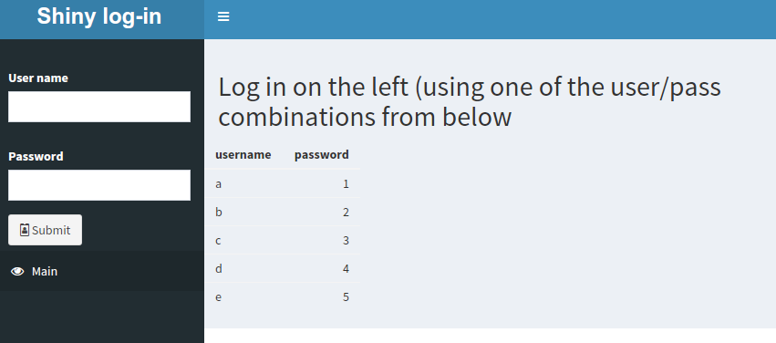
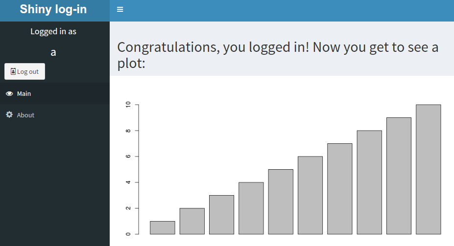

# shinylogin
An example shiny app with user/password authentication

## What

This is a minimal shiny app which exhibits how unique users/passwords can be used.

## How

The app starts with a limited sidebar menu, including a space to enter log-in information.

Once logged in, the sidebar expands (note the "About" menu item), and the tab contents changes.

Reactive objects such as `ok()` and `user()` are generated dynamically so as to track whether the log-in is successful and what the user name is, respectively.

## Why  

Because sometimes (a) you only want some people to access your shiny app, and/or (b) a user's identity is important to the app's functionality.

## Extending use  

In this example, the `users` object (which contains users' names and passwords) is a simple dataframe, created in the `app.R` script. To the extent that creating data in-code can be unwieldy, one might consider using a spreadsheet file (such as a `.csv`), an external package (such as `gsheets`) or a database for storing the `users` object. 

## Caveats  

This is a minimal viable example. The table of usernames and passwords is expected to exist in memory as an unhashed dataframe. For app's with substantial security needs, more complex solutions should be considered.

Contact
=======

[Databrew](http://www.databrew.cc), empowering researchers in academia and industry to explore, understand, and communicate their data through consulting and teaching. <a href="mailto:info@databrew.cc?Subject=Hello" target="_top">info@databrew.cc</a>.

